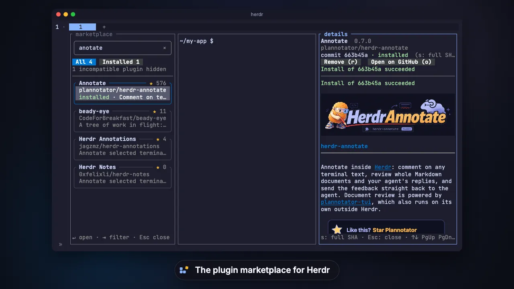

<div align="center">

# herdr-marketplace

**Search, read, install and update [Herdr](https://herdr.dev) plugins without leaving your terminal.**

[](https://github.com/massdo/herdr-marketplace/actions/workflows/ci.yml)
[](https://herdr.dev)
[](#requirements)
[](LICENSE)



<sub>Real marketplace screens. The plugin shown is <a href="https://github.com/plannotator/herdr-annotate">Annotate</a> by plannotator.</sub>

</div>

## Install

```sh
herdr plugin install massdo/herdr-marketplace
```

On macOS and on Linux x86_64, this takes a few seconds: the install fetches
the plugin's prebuilt binary, about 15 MB, and checks it against the release's
SHA-256 sums. Elsewhere, or for a commit without a release, it builds the
plugin from source, which takes a few minutes. Then, from any Herdr pane, open
the marketplace: a sidebar on the left of the current tab. The same command
closes it.

```sh
herdr plugin action invoke herdr-marketplace.toggle
```

To open it with <kbd>prefix</kbd> <kbd>shift</kbd>+<kbd>M</kbd> instead, add
this to Herdr's `config.toml`:

```toml
[[keys.command]]
key = "prefix+shift+m"
type = "plugin_action"
command = "herdr-marketplace.toggle"
description = "Marketplace"
```

## Features

It works like the extensions view of VS Code, in a sidebar next to your panes.

- **Search the whole catalog.** 1,300+ plugins, filtered as you type by name,
  topic, author or description. Typos are forgiven: `anotate` finds Annotate.
- **Read before you install.** Every README is drawn like on GitHub, with
  headings, code, tables, alerts, images and links, at the exact commit you
  would install. Selecting another plugin updates the same Details pane,
  keeping its size and focus. Animated GIF, WebP and PNG images play. Visible videos
  start automatically without sound while they download. Click or `Space`/`p`
  pauses and resumes; the controls and `←`/`→` seek. Videos stay cached when
  you switch plugins or close Details, until Marketplace closes and clears
  all of that session's videos.
- **Install with one key.** `i` previews the source, the commit and the
  commands the plugin declares; `Enter` confirms, `Esc` cancels. The same key
  moves an installed plugin to the catalog's commit, and `r` removes it.
- **Update in one click.** When the catalog has a newer version of an
  installed plugin, its card shows **Update to x.y.z**: one click updates
  it, without a preview. The **Updates** tab lists them.
- **Keyboard or mouse.** Click, scroll and drag to copy text, or never leave
  the keyboard.

## Keys

| Key | Where | Action |
| --- | --- | --- |
| Type | Sidebar | Search; `@installed` and `@outdated` pick a filter; an open preview shows the first result |
| `↑` `↓` `PgUp` `PgDn` `Home` `End` | Sidebar | Move, and preview the plugin beside the list |
| `↑` `↓` `PgUp` `PgDn` `Home` `End` | Details | Scroll |
| Click a plugin | Sidebar | Preview it, the sidebar keeps the focus |
| Click **Update** on a card | Sidebar | Update the plugin, without a preview |
| `Enter` | Sidebar | Open the selected plugin and focus it |
| `Tab` | Sidebar | Switch between **All**, **Installed** and **Updates** |
| `i` | Details | Install, or switch to the catalog's commit |
| `u` | Details | Update to the catalog's newer version, without a preview |
| `r` | Details | Remove |
| `o` | Details | Open on GitHub |
| `s` | Details | Show the full commit SHA |
| `Space`, `p` | Details | Pause, resume or replay the video in view |
| `←`, `→` | Details | Seek backward or forward by 5 seconds |
| `Enter` / `Esc` | Install or removal | Confirm / cancel |
| `Esc` | Sidebar | Clear the search, show All, then close |
| `q` | Details | Close the pane |

> [!IMPORTANT]
> A community plugin, not an official Herdr product. The catalog is indexed
> automatically: its plugins are not reviewed or endorsed by Herdr or by this
> plugin. Installing one runs its code with your permissions, so read its
> source and the install preview before you confirm.

## Requirements

- Herdr 0.9.1 or later (tested with 0.9.1), on macOS or Linux.
- `git`, which Herdr installs plugins with, `curl` or GNU wget, and network
  access: the binary, READMEs and manifests come from GitHub, the catalog from
  herdr.dev.
- Rust 1.89 or later, only when the plugin builds from source. If Homebrew's
  Cargo comes before rustup's on your `PATH`, run
  `export PATH="$HOME/.cargo/bin:$PATH"` first.
- Videos in READMEs play with a private copy of FFmpeg that the prebuilt
  install brings; a build from source opens them in the browser.

Good to know: the marketplace downloads the catalog index once, about 270 KB
compressed. Reopening shows the saved catalog immediately while an ETag check
runs in the background; changes update the list without resetting your search
or selection. If the check fails, the saved catalog stays available. V2 will
bring a small server so you can skip that download.

To update, run the install command again, then close and reopen the
marketplace. A marketplace installed from GitHub also announces its own
updates on its card: update it there, then close and reopen it.

## License

MIT, see [LICENSE](LICENSE). The Herdr socket client, the left dock, the
launcher lock and the install script come from herdr-npm and herdr-sidebar
(MIT): see [NOTICE](NOTICE).
